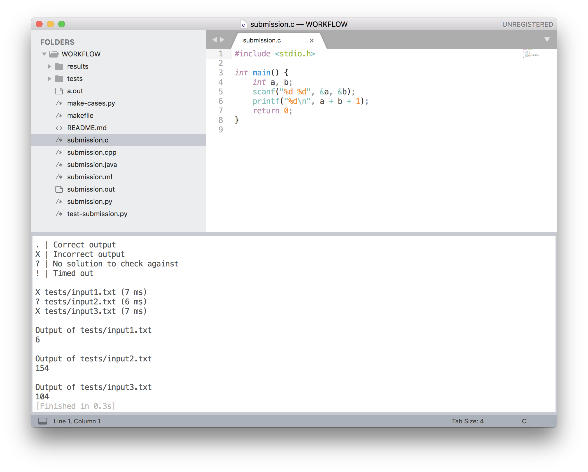
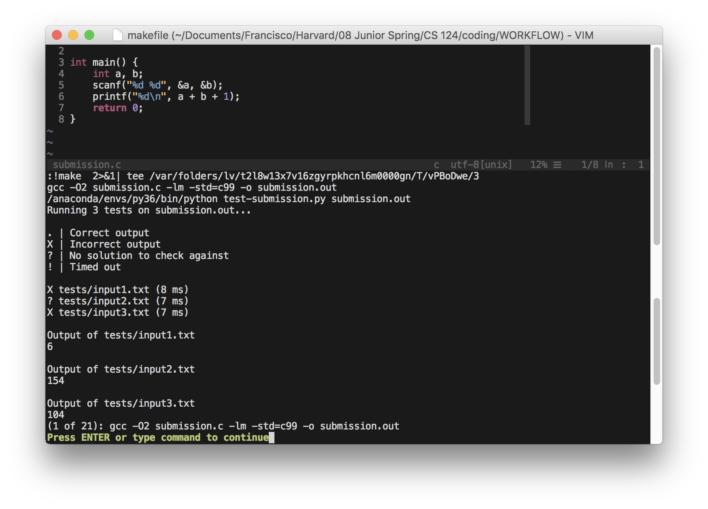

CS 124 Programming Problem Workflow
===================================

## Introduction

This repo grew out of a desire to optimize the CS 124 testing workflow. It
consists of a main script that runs tests as well as some notes on setting up
the workflow.

## Setting-up

Put input files to be tested in the `tests/` directory. These can take the form
of `tests/input<whatever you want>.txt`. I generally label them by number, but
short descriptive names are also possible so long as they begin with `input`. If
for an input file, there exists a corresponding output file whose name is the
same except that it begins with `output` instead of `input`, then the script
will check whether the output is correct. Otherwise, the script will not check
correctness.

Small test cases can be generated by hand, but larger ones will generally have
to be generated by a program. In this example, the first two test cases are
hand-made, and the third test case is generated by `make-cases.py`. Note that
correct outputs can also be generated programatically for small inputs using a
program that implements a naive solution.

## Running

To run the tests, run

```
python3 test-submission.py <submission>
```

If the submission is in Python 2.7, then `<submission>` is just the Python file.
For Java, it's the generated `class` file. Any executable will also work (such
as a C `.out` file). This prints out something like,

```
. | Correct output
X | Incorrect output
? | No solution to check against
! | Timed out

X tests/input1.txt (9 ms)
? tests/input2.txt (7 ms)

Output of tests/input1.txt
6

Output of tests/input2.txt
154  
```

Outputs will only be printed out if the code didn't time out and it wasn't
correct. Note that the output times are sensitive to the computer being run on,
and carry some overhead from the Python script. Thus, they can only be used as
rough estimates. In order to get the timeouts to work in a simple fashion, the
testing script was written in Python 3.6. This script is meant to work in a
distribution in which `python3` runs Python 3.6, and `Python` runs Python 2.7.
Note that even though `test-submission.py` is written in Python 3.6, the
submission file that it tests is going to be run as Python 2.7.

## Optimizing through makefile

What we have is already very automized, running all our tests at once and
telling us how we're doing. It's a bit of a pain to change from a text-editor to
the terminal to possibly compile our code and run the test running code, though.
A way to automize this even further is through the use of a makefile. We can
write,

```
all: submission.c test-submission.py
	gcc -O2 submission.c -lm -std=c99 -o submission.out
	python3 test-submission.py submission.out
```

in our makefile. Makefiles are generally used for compiling code with
dependencies, but for our purposes, they can also be used to run all our tests.
It essentially lets us write down all the commands that we generally want to run
at once when we build our code. That way we don't have to keep on invoking them.

We could run the compile step and the testing step at once by just typing

```
make all
```

into the Terminal. We can also, however, integrate this with our text editor.
For instance, if you're using Vim, you can type `:make` right from the text
editor to make your code (or map a single key in normal mode to make code). If
you're using Sublime, you can type `Command-B`, and then click on "Make" to the
same effect. Most other text editors have similar functionality. Screenshots
follow for Sublime and Vim, which are the ones I'm most familiar with.




